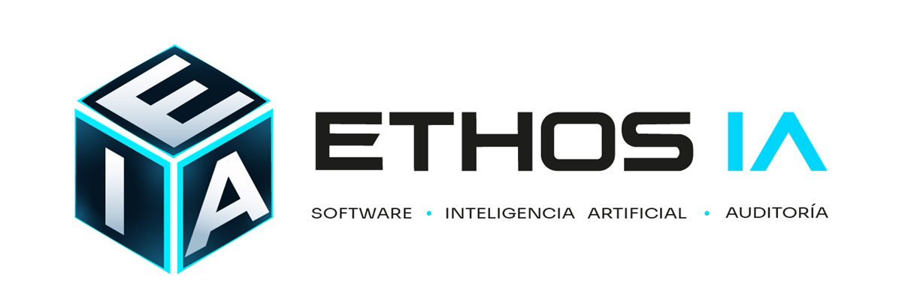

<div align="center">

<picture>
  <source media="(prefers-color-scheme: dark)" srcset="public/empresa/banner-dark.png">
  <source media="(prefers-color-scheme: light)" srcset="public/empresa/banner-light.png">
  
</picture>

<br>

**Sitio web corporativo de Ethos IA**, la firma de inteligencia artificial ética y responsable de **ETHOSLAB S.A.S.** — Cuenca, Ecuador.

<br>

[](https://github.com/ethos-ia-ec/ethos_ia/actions/workflows/ci.yml)
[](https://www.ethosia.tech)
[](https://nextjs.org)
[](https://react.dev)
[](https://supabase.com)
[](https://vercel.com)

<a href="https://www.ethosia.tech"><b>Ver el sitio en vivo →</b></a>

</div>

<br>

---

## Sobre el proyecto

Este repositorio contiene la web corporativa de Ethos IA: la cara pública de la empresa y su canal principal de contacto comercial. No es una plantilla ni una demo — es el sitio que está en producción en [ethosia.tech](https://www.ethosia.tech).

Incluye la landing institucional, la página de equipo, un asistente conversacional con IA y el formulario de captación que escribe en Supabase.

## Características

| | |
|---|---|
| **Landing corporativa** | Propuesta de valor, líneas de servicio, trayectoria y proceso de trabajo |
| **Asistente con IA** | Chat integrado que responde consultas sobre la empresa y sus servicios |
| **Captación de leads** | Formulario validado con Zod que persiste en Supabase |
| **Multiproveedor de IA** | Cadena de respaldo entre Groq, OpenRouter y NVIDIA con cuota diaria por proveedor |
| **Seguridad por defecto** | CSP, cabeceras de seguridad, rate limiting y autenticación interna por API key |
| **Accesibilidad** | Contraste verificado contra WCAG AA y estructura semántica en español |

## Stack

| Capa | Tecnología |
|---|---|
| Framework | Next.js 16 (Pages Router) · React 19 · Turbopack |
| Datos | Supabase (PostgreSQL) con migraciones versionadas |
| Validación | Zod |
| Tipografía | Sora, autohospedada con `next/font` |
| Calidad | ESLint · Vitest · GitHub Actions |
| Infraestructura | Vercel · Docker |

## Inicio rápido

**Requisitos:** Node.js 22 o superior.

```bash
git clone https://github.com/ethos-ia-ec/ethos_ia.git
cd ethos_ia
npm install
```

Copia la plantilla de variables de entorno y complétala:

```bash
cp .env.local.example .env.local
```

| Variable | Para qué sirve |
|---|---|
| `SUPABASE_URL`, `SUPABASE_ANON_KEY`, `SUPABASE_SERVICE_ROLE_KEY` | Conexión a la base de datos |
| `GROQ_API_KEY`, `OPENROUTER_API_KEY`, `NVIDIA_API_KEY` | Proveedores del asistente de IA |
| `GROQ_DAILY_LIMIT`, `OPENROUTER_DAILY_LIMIT`, `NVIDIA_DAILY_LIMIT` | Tope diario de peticiones por proveedor |
| `INTERNAL_API_KEY` | Autenticación de endpoints internos |
| `NEXT_PUBLIC_SITE_URL` | URL canónica del sitio |
| `NEXT_PUBLIC_GA_MEASUREMENT_ID` | Analítica (opcional) |
| `ALERT_WEBHOOK_URL` | Notificaciones de alertas (opcional) |

Levanta el entorno de desarrollo:

```bash
npm run dev
```

El sitio queda en `http://localhost:3000`.

## Comandos

| Comando | Descripción |
|---|---|
| `npm run dev` | Servidor de desarrollo con Turbopack |
| `npm run build` | Compilación de producción |
| `npm start` | Sirve la compilación de producción |
| `npm run lint` | Análisis estático con ESLint |
| `npm test` | Suite de pruebas con Vitest |

## Estructura

```text
├── pages/
│   ├── index.js            Landing corporativa
│   ├── equipo.js           Perfiles directivos y equipo
│   ├── _app.js             Tipografía global (Sora)
│   ├── _document.js        Documento HTML, favicon, idioma
│   └── api/
│       ├── empresa-chat.js Asistente con IA
│       └── join.js         Recepción de formularios
├── components/
│   └── ChatWidget.js       Interfaz del asistente
├── lib/
│   ├── ai/complete.js      Orquestación multiproveedor
│   ├── rateLimit.js        Control de abuso
│   └── internalAuth.js     Autenticación interna
├── supabase/migrations/    Esquema versionado
└── public/empresa/         Identidad visual y recursos
```

## API

| Endpoint | Método | Descripción |
|---|---|---|
| `/api/empresa-chat` | `POST` | Consulta al asistente. Aplica rate limiting y cuota diaria por proveedor. |
| `/api/join` | `POST` | Recibe el formulario de contacto, lo valida con Zod y lo persiste en Supabase. |

### Orquestación de IA

`lib/ai/complete.js` recorre los proveedores en cadena y cae al siguiente cuando uno agota su cuota diaria o falla:

1. **Groq** — `openai/gpt-oss-20b`
2. **OpenRouter** — enrutador automático entre modelos gratuitos disponibles
3. **NVIDIA** — `meta/llama-3.1-8b-instruct`

Cada proveedor lleva su propio contador diario, persistido en Supabase, de modo que el respaldo no duplica el consumo de cuota.

## Seguridad

- Cabeceras `X-Frame-Options`, `X-Content-Type-Options`, `Referrer-Policy`, `Permissions-Policy` y HSTS.
- Content Security Policy en modo `report-only`, restringida a recursos propios.
- Rate limiting por IP sobre los endpoints de IA y formularios.
- Credenciales fuera del control de versiones: `.env*` está ignorado salvo la plantilla de ejemplo.

## Despliegue

El sitio está en producción en **Vercel**, desplegado desde la rama `main`. En paralelo, cada push y cada pull request ejecutan el flujo de CI en GitHub Actions (`lint`, `test`, `build`).

También se puede levantar con Docker:

```bash
docker compose build
docker compose up
```

## Créditos

La identidad visual y el logotipo de Ethos IA fueron ideados, diseñados y creados por **William Alejandro Toscano Pérez**, Licenciado en Multimedia y Producción Audiovisual por la Universidad Estatal de Milagro.

El equipo detrás del proyecto está en [ethosia.tech/equipo](https://www.ethosia.tech/equipo).

## Contacto

- **Sitio** — [ethosia.tech](https://www.ethosia.tech)
- **Correo** — ethos.ia.ec@gmail.com
- **WhatsApp** — [+593 98 602 3149](https://wa.me/593986023149)
- **Organización** — [github.com/ethos-ia-ec](https://github.com/ethos-ia-ec)

---

<div align="center">
<sub>© 2026 ETHOSLAB S.A.S. — Cuenca, Azuay, Ecuador. Todos los derechos reservados.</sub>
</div>
