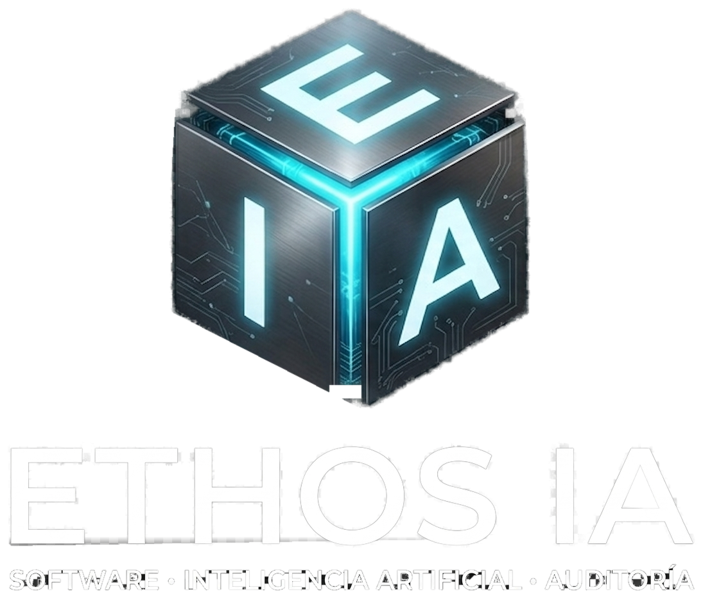

<div align="center">
  <picture>
    <source media="(prefers-color-scheme: dark)" srcset="public/empresa/ethos-ia-logo-readme.png">
    <source media="(prefers-color-scheme: light)" srcset="public/empresa/ethos-ia-logo-readme-light.png">
    
  </picture>
</div>

# Ethos IA — Sitio web corporativo

Sitio web oficial de **Ethos IA**, la marca de software a medida e inteligencia artificial responsable de **Pérez & Herrera S.A.S.** (Ecuador). Proyecto independiente — no depende del repositorio de "El Club de la Ingeniería" (de donde se migró originalmente), aunque reutiliza el mismo patrón de cascada de IA.

## Estructura

```
sitio-web-ethos-ia/
├── pages/
│   ├── index.js              # Home — hero, líneas de negocio, historia, misión/visión, contacto
│   ├── equipo.js              # Dirección general y técnica
│   └── api/
│       ├── join.js            # Guarda leads del formulario en Supabase (tabla solicitudes)
│       └── empresa-chat.js    # Chat con IA — usado por el widget del sitio Y por el bot de WhatsApp
├── components/
│   └── ChatWidget.js          # Widget de chat: burbuja, voz (Web Speech API), pantalla completa
├── lib/
│   ├── ai/complete.js         # Cascada Groq → OpenRouter → NVIDIA, con cuota diaria en Supabase
│   └── rateLimit.js           # Anti-abuso por IP (Supabase, con respaldo en memoria)
├── public/
│   ├── privacidad.html        # Política de tratamiento de datos (LOPDP)
│   └── empresa/               # Todas las imágenes de marca (logo, hero, fotos de sección)
└── supabase/migrations/       # Solo de referencia — ver "Base de datos" abajo
```

## Configurar y correr

```bash
npm install
cp .env.local.example .env.local
# rellena las claves de Groq/OpenRouter/NVIDIA y las de Supabase
npm run dev
```

Abre [http://localhost:3000](http://localhost:3000).

## Docker (portabilidad local, no para producción)

La producción real de este sitio va a **Vercel** (SSL, CDN y escalado automático, sin mantener servidor). Docker aquí es para que el entorno de desarrollo sea idéntico en cualquier máquina, o para probar el build de producción sin depender de Vercel — mismo patrón ya probado en "El Club de la Ingeniería".

```bash
docker compose build
docker compose up
```

Usa las mismas variables de `.env.local` (vía `env_file`, nunca se copian dentro de la imagen). El sitio queda en `http://localhost:3000`, igual que con `npm run dev`.

## Base de datos (Supabase)

Este sitio **no necesita un proyecto Supabase nuevo** si ya tienes uno para "El Club de la Ingeniería" — puedes apuntar las mismas credenciales (`SUPABASE_URL`, `SUPABASE_SERVICE_ROLE_KEY`) a ese mismo proyecto, y listo: la tabla `ia_uso_diario` ya existe ahí y la cuota de IA queda compartida entre ambos sitios sin configurar nada extra.

Si en algún momento quieres un proyecto Supabase separado solo para Ethos IA, las migraciones en `supabase/migrations/` (copiadas del repo original, solo como referencia) crean lo necesario:
- `0001_auth_and_members.sql` → tabla `solicitudes` (usada por `/api/join`)
- `0002_ia_uso_diario.sql` → tabla y función RPC para la cuota diaria de IA
- `0004_rate_limits.sql` → tabla y función RPC para el límite de peticiones por IP

## El bot de WhatsApp

El microservicio `ethos-ia-whatsapp-bot/` (carpeta hermana de este proyecto, dentro de la carpeta del Club de Ingeniería por ahora) llama a `POST /api/empresa-chat` y `POST /api/join` de **este** sitio. Su variable de entorno `MAIN_SITE_URL` debe apuntar a donde despliegues este sitio — actualízala cuando tengas el dominio real.

## Dominio

Los archivos `pages/index.js` y `pages/equipo.js` tienen una constante `SITE_URL` al inicio (por ahora `https://ethos-ia.example.com`, un dominio de ejemplo que nunca resuelve) — reemplázala por el dominio real en cuanto lo tengas. Se usa en las metaetiquetas Open Graph/Twitter y en el JSON-LD, no afecta la navegación interna del sitio.
